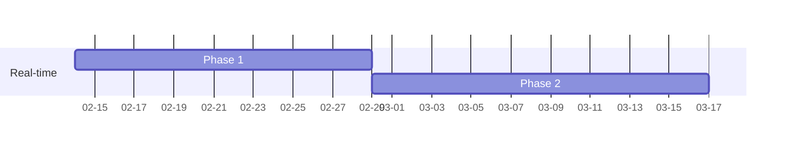

Financial-Portfolio-Simulator
===

## System Design

### Real-time system
Periodically fetch stock quote from API and store data into a distributed database.
**1. Request Scheduler**
Check the market opening hour on a daily basis and schedule Request Handler.
**2. Request Handler**
Schedule crawling task to retrieve stock quote data.
**3. DB Handler**
Implement data partitioning and other  horizontal scaling logic to distribute data.
**4. Distributed DB**
Construct a distributed database.
#### Data Model
In the MongoDB setup, each stock's data is distributed across multiple databases within a single MongoDB server. In each database, stock data is stored in a collection named after the stock symbol. Below is an example:
```jsonld
'AAPL' // collection name
{
    '_id': 'a unique id of this data',
    'c': 'current price',
    'd': 'change',
    'dp': 'percent change',
    'h': 'high price',
    'l': 'low price',
    'o': 'open price',
    'pc': 'prev close price',
    'timestamp': ISODate()

},{
    ...
}
```


## Project Timeline
---



> Read more about mermaid here: <http://mermaid-js.github.io/mermaid/>
